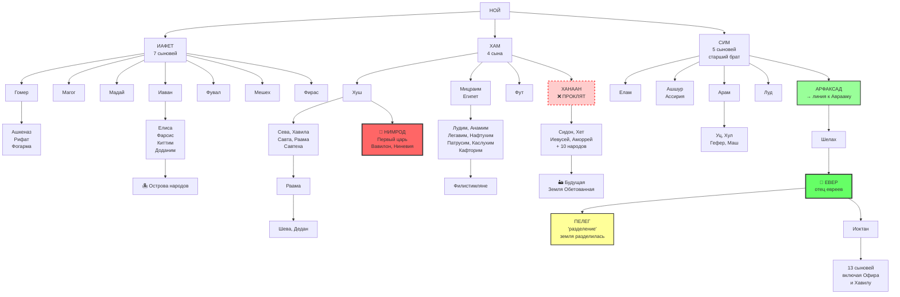

# Бытие

---
## Глава 6

### Сыны Божии и дочери человеческие

**1** И было, когда люди (адам) начали умножаться на лике земли и дочери родились у них,

**2** увидели сыны Божии (בְּנֵי הָאֱלֹהִים, бней ха-элохим) дочерей человеческих, что прекрасны (*хороши*) они, и брали себе жён из всех, кого выбирали.

*//ℹ︎ «Сыны Божии» — загадочное выражение, толкуемое как ангелы, потомки Сифа или властители. В угаритских текстах подобное выражение обозначает божественный совет.*

**3** И сказал Господь (יהוה, ЙХВХ): «Не пребудет (*не будет тяжбиться*) дух Мой в человеке вовеки, ибо он плоть; да будут дни его сто двадцать лет».

*//ℹ︎ «Не пребудет» — глагол «йадон» неясного значения; возможно, «не останется», «не будет судиться» или «не будет бороться».*

**4** Исполины (нефилим) были на земле в те дни, и также после того, как входили сыны Божии к дочерям человеческим, и те рождали им. Это богатыри (*сильные*), что издревле, люди именитые (*люди имени*).

*//ℹ︎ «Нефилим» — буквально «падшие» или «павшие»; возможно, от корня «падать» или «нападать». Упоминаются также в Числ. 13:33.*

### Развращение человечества и решение о потопе

**5** И увидел Господь (יהוה, ЙХВХ), что велика злоба человеческая на земле, и что всякое помышление (*йецер*) мыслей сердца его только зло во всякое время.

*//ℹ︎ «Йецер» — образование, склонность, импульс. Позднее в раввинистической литературе — «йецер ха-ра» (злое начало).*

**6** И раскаялся (*утешился, пожалел*) Господь (יהוה, ЙХВХ), что создал человека на земле, и восскорбел (*огорчился*) в сердце Своём.

*//ℹ︎ Антропоморфное описание Божественных эмоций. Глагол «нахам» может означать как раскаяние, так и утешение или изменение намерения.*

**7** И сказал Господь (יהוה, ЙХВХ): «Сотру (*смахну*) человека, которого Я сотворил, с лица земли — от человека до скота, до пресмыкающегося и до птиц небесных, ибо Я раскаялся, что создал их».

### Ной обретает благоволение

**8** Ной же обрёл благоволение (*милость*) в очах Господа (יהוה, ЙХВХ).

**9** Вот родословие (*толдот*) Ноя: Ной — муж праведный, непорочный (*цельный*) был в поколениях своих; с Богом (אֱלֹהִים, Элохим) ходил Ной.

*//ℹ︎ «Ходил с Богом» — выражение, обозначающее близкие отношения с Божеством и праведную жизнь; ранее применялось к Еноху (5:24).*

**10** И родил Ной трёх сыновей: Сима, Хама и Иафета.

**11** И растлилась земля пред лицом Божиим (אֱלֹהִים, Элохим), и наполнилась земля насилием (хамас).

*//ℹ︎ «Хамас» — насилие, несправедливость, беззаконие. Не просто насилие, но нарушение социального порядка.*

**12** И воззрел Бог (אֱלֹהִים, Элохим) на землю, и вот, растлилась она, ибо извратила всякая плоть путь свой на земле.

### Повеление о ковчеге

**13** И сказал Бог (אֱלֹהִים, Элохим) Ною: «Конец всякой плоти пришёл предо Мною, ибо земля наполнилась злодеянием их; и вот, Я истреблю (*погублю*) их с землёю.

**14** Сделай себе ковчег (тева) из дерева гофер; отделения (*гнёзда*) сделай в ковчеге и осмоли его изнутри и снаружи смолою (*дёгтем*).

*//ℹ︎ «Тева» — ящик, короб. То же слово используется для корзинки младенца Моисея. «Гофер» — дерево неизвестной породы.*

**15** И вот как ты сделаешь его: триста локтей длина ковчега, пятьдесят локтей ширина его и тридцать локтей высота его.

**16** Просвет (*окно, крышу*) сделай в ковчеге и в локоть сведи его сверху; и дверь ковчега сделай в боку его; нижний, второй и третий ярусы сделай в нём.

*//ℹ︎ «Цохар» — неясное слово; может означать «окно», «просвет» или «крышу».*

**17** А Я, вот, Я наведу потоп — воды на землю, чтобы истребить всякую плоть, в которой есть дух жизни (руах хайим), из-под небес; всё, что на земле, погибнет (*испустит дух*).

**18** Но с тобою Я установлю завет Мой (берит), и войдёшь в ковчег ты, и сыновья твои, и жена твоя, и жёны сынов твоих с тобою.

*//ℹ︎ Первое упоминание «завета» (берит) в Библии — торжественного соглашения между Богом и человеком.*

**19** И из всего живого, от всякой плоти, по два от всего введи в ковчег, чтобы остались в живых с тобою; мужского пола и женского пусть будут они.

**20** От птиц по роду их, и от скота по роду его, и от всякого пресмыкающегося по земле по роду его, — по два от всего войдут к тебе, чтобы остались в живых.

**21** Ты же возьми себе всякой пищи, какою питаются, и собери к себе; и будет она для тебя и для них пищею».

**22** И сделал Ной всё; как повелел ему Бог (אֱלֹהִים, Элохим), так он и сделал.

---
## Глава 7

### Вход в ковчег

**1** И сказал Господь (יהוה, ЙХВХ) Ною: «Войди ты и весь дом твой в ковчег, ибо тебя увидел Я праведным предо Мною в поколении сем.

**2** Из всякого скота чистого возьми с собою по семи пар (*по семи по семи*), мужского пола и женского, а из скота нечистого — по паре (*по два*), мужского пола и женского;

**3** также и из птиц небесных — по семи пар (*по семи по семи*), мужского пола и женского, чтобы сохранить семя (*потомство*) живым на лице всей земли.

**4** Ибо через семь дней Я буду изливать дождь на землю сорок дней и сорок ночей и истреблю (*сотру*) с лица земли всё существующее, что Я создал».

**5** И сделал Ной всё, что Господь (יהוה, ЙХВХ) повелел ему.

**6** Ной же был шестисот лет, когда потоп водный пришёл на землю.

**7** И вошёл Ной, и сыновья его, и жена его, и жёны сынов его с ним в ковчег от вод потопа.

**8** От скота чистого и от скота нечистого, и от птиц, и от всего, что пресмыкается по земле,

**9** по два вошли к Ною в ковчег, мужского пола и женского, как повелел Бог (אֱלֹהִים, Элохим) Ною.

### Начало потопа

**10** И было, через семь дней воды потопа пришли на землю.

**11** В шестисотый год жизни Ноевой, во второй месяц, в семнадцатый день месяца, в день сей разверзлись все источники великой бездны (техом рабба), и окна (*шлюзы*) небесные отворились.

*//ℹ︎ «Техом» — первозданная бездна, хаотические воды. Возвращение к состоянию до творения.*

**12** И был дождь на земле сорок дней и сорок ночей.

**13** В тот самый день вошёл в ковчег Ной, и Сим, Хам и Иафет, сыновья Ноевы, и жена Ноева, и три жены сынов его с ними.

**14** Они, и всякий зверь по роду его, и всякий скот по роду его, и всякое пресмыкающееся, пресмыкающееся по земле, по роду его, и всякая птица по роду её, всякая птичка, всякое крылатое.

**15** И вошли к Ною в ковчег по два от всякой плоти, в которой есть дух жизни.

**16** И вошедшие, мужского пола и женского от всякой плоти вошли, как повелел ему Бог (אֱלֹהִים, Элохим). И затворил Господь (יהוה, ЙХВХ) за ним.

### Всемирный потоп

**17** И был потоп сорок дней на земле; и умножились воды, и подняли ковчег, и он возвысился над землёю.

**18** И усилились воды, и весьма умножились на земле; и плыл ковчег по лицу вод.

**19** И усилились воды чрезвычайно (*очень-очень*) на земле; и покрылись все высокие горы, которые под всем небом.

**20** На пятнадцать локтей вверх поднялись воды, и покрылись горы.

**21** И погибла (*испустила дух*) всякая плоть, движущаяся по земле: и птицы, и скот, и звери, и все кишащие, кишащие по земле, и всякий человек.

**22** Всё, в чьих ноздрях дыхание духа жизни (нишмат руах хайим), из всех, которые на суше, умерли.

*//ℹ︎ Двойное выражение «нишмат-руах» подчёркивает полноту жизненной силы.*

**23** И истребилось (*стёрлось*) всё существующее, которое на лице земли: от человека до скота, до пресмыкающегося и до птиц небесных — истребились они с земли; и остался только Ной и те, кто с ним в ковчеге.

**24** И возвышались (*усиливались*) воды на земле сто пятьдесят дней.

---
## Глава 8

### Спад вод

**1** И вспомнил Бог (אֱלֹהִים, Элохим) о Ное, и о всяком звере, и о всяком скоте, который с ним в ковчеге; и навёл Бог (אֱלֹהִים, Элохим) ветер (руах) на землю, и улеглись воды.

*//ℹ︎ «Вспомнил» — не забывчивость, но переход к активному действию. «Руах» — тот же дух, что витал над водами при творении (1:2).*

**2** И закрылись источники бездны и окна небесные, и остановился дождь с небес.

**3** И отступали воды с земли, уходя и возвращаясь; и стали убывать воды по окончании ста пятидесяти дней.

**4** И остановился ковчег в седьмом месяце, в семнадцатый день месяца, на горах Араратских.

*//ℹ︎ «Горы Араратские» — горная область Урарту в восточной Анатолии, не обязательно современная гора Арарат.*

**5** И воды убывали постоянно до десятого месяца; в десятом месяце, в первый день месяца, показались вершины гор.

### Ворон и голубь

**6** И было, по окончании сорока дней открыл Ной окно ковчега, которое он сделал.

**7** И выпустил ворона; и он вылетал, уходя и возвращаясь, пока не иссохли воды на земле.

**8** И выпустил от себя голубя, чтобы увидеть, убыли ли воды с лица земли.

**9** Но голубь не нашёл покоя для ступни ноги своей и возвратился к нему в ковчег, ибо воды на лице всей земли; и он простёр руку свою, и взял его, и внёс к себе в ковчег.

**10** И помедлил ещё семь дней других и опять выпустил голубя из ковчега.

**11** И возвратился к нему голубь в вечернее время; и вот, свежий (*сорванный*) лист оливы в клюве его. И узнал Ной, что убыли воды с земли.

**12** И помедлил ещё семь дней других и выпустил голубя; и он уже не возвратился к нему более.

### Выход из ковчега

**13** И было в шестьсот первом году, в первый месяц, в первый день месяца, иссохли воды на земле. И снял Ной кровлю ковчега, и посмотрел, и вот, обсохло лице земли.

**14** А во втором месяце, в двадцать седьмой день месяца, высохла земля.

**15** И сказал Бог (אֱלֹהִים, Элохим) Ною, говоря:

**16** «Выйди из ковчега ты и жена твоя, и сыновья твои, и жёны сынов твоих с тобою.

**17** Всякое животное, которое с тобою, от всякой плоти: из птиц, и из скота, и из всякого пресмыкающегося, пресмыкающегося по земле, — выведи с собою; и пусть кишат (*разводятся*) на земле, и пусть плодятся и размножаются на земле».

**18** И вышел Ной, и сыновья его, и жена его, и жёны сынов его с ним.

**19** Всякое животное, всякое пресмыкающееся и всякая птица — всё движущееся по земле — по семействам своим вышли из ковчега.

### Жертвоприношение Ноя

**20** И устроил Ной жертвенник Господу (יהוה, ЙХВХ), и взял из всякого скота чистого и из всех птиц чистых, и вознёс всесожжения на жертвеннике.

**21** И обонял Господь (יהוה, ЙХВХ) приятное благоухание (*запах успокоения, реах нихоах*), и сказал Господь (יהוה, ЙХВХ) в сердце Своём: «Не буду больше проклинать землю за человека, ибо помышление (*йецер*) сердца человеческого — зло от юности его; и не буду больше поражать всё живущее, как Я сделал.

*//ℹ︎ «Благоухание умиротворяющее» (реах нихоах) — антропоморфизм; выражает принятие Богом жертвы. Бог «успокаивается» запахом от Ноя.*

**22** Впредь во все дни земли сеяние и жатва, холод и зной, лето и зима, день и ночь не прекратятся».

---
## Глава 9

### Завет с Ноем

**1** И благословил Бог (אֱלֹהִים, Элохим) Ноя и сынов его, и сказал им: «Плодитесь и размножайтесь, и наполняйте землю.

**2** И страх пред вами и трепет пред вами да будет на всяком звере земном и на всякой птице небесной, на всём, что движется на земле, и на всех рыбах морских; в руки ваши отданы они.

**3** Всё движущееся, что живёт, будет вам в пищу; как зелень травную, даю вам всё.

**4** Только плоти с душою её, с кровью её, не ешьте.

*//ℹ︎ Кровь отождествляется с жизнью (нефеш). Запрет есть кровь — универсальный закон для всего человечества.*

**5** И взыщу также кровь вашу, в которой души ваши: взыщу её от руки всякого зверя и от руки человека; от руки брата его взыщу душу человека.

**6** Кто прольёт кровь человеческую, того кровь человеком прольётся; ибо по образу Божию создал Он человека.

*//ℹ︎ Принцип «талиона» основан на богоподобии человека. Убийство — посягательство на образ Божий.*

**7** Вы же плодитесь и размножайтесь, кишите (*размножайтесь во множестве*) на земле и умножайтесь на ней».

### Знамение завета

**8** И сказал Бог (אֱלֹהִים, Элохим) Ною и сынам его с ним, говоря:

**9** «Вот, Я, Я устанавливаю завет Мой с вами и с потомством вашим после вас,

**10** и со всякою душою живою, которая с вами: с птицами и со скотом, и со всеми зверями земными у вас, со всеми вышедшими из ковчега, со всеми животными земными.

**11** И установлю завет Мой с вами, что не будет более истреблена всякая плоть водами потопа, и не будет более потопа на погубление земли».

**12** И сказал Бог (אֱלֹהִים, Элохим): «Вот знамение завета, который Я устанавливаю между Мною и между вами, и между всякою душою живою, которая с вами, на поколения вечные:

**13** Радугу Мою полагаю (*дал*) в облаке, и будет она знамением завета между Мною и между землёю.

*//ℹ︎ «Кешет» — то же слово, что «боевой лук»: радуга подана как отложенное оружие, знак конца войны с человечеством.*

**14** И будет, когда Я наведу облако на землю, то явится радуга в облаке.

**15** И вспомню завет Мой, который между Мною и между вами и между всякою душою живою во всякой плоти; и не будет более вода потопом на истребление всякой плоти.

**16** И будет радуга в облаке; и Я увижу её и вспомню завет вечный между Богом и между всякою душою живою во всякой плоти, которая на земле».

**17** И сказал Бог (אֱלֹהִים, Элохим) Ною: «Вот знамение завета, который Я установил между Мною и между всякою плотью, которая на земле».

### Ной и его сыновья

**18** И были сыновья Ноя, вышедшие из ковчега: Сим, Хам и Иафет. Хам же — отец Ханаана.

**19** Трое сих — сыновья Ноевы, и от них населилась (*расселилась*) вся земля.

**20** И начал Ной, человек земли, и насадил виноградник.

*//ℹ︎ «Человек земли» (иш ха-адама) — земледелец; параллель с Адамом, взятым от земли.*

**21** И выпил он вина, и опьянел, и обнажился в шатре своём.

**22** И увидел Хам, отец Ханаана, наготу отца своего и рассказал двум братьям своим снаружи.

*//ℹ︎ «Увидеть наготу» — эвфемизм для сексуального нарушения или кастрации в древневосточных текстах.*

**23** И взяли Сим и Иафет одежду, и положили на плечи обоих, и пошли задом, и покрыли наготу отца своего; и лица их обращены назад, и наготы отца своего они не видели.

**24** И проспался Ной от вина своего и узнал, что сделал ему сын его младший.

**25** И сказал: «Проклят Ханаан! Рабом рабов будет он у братьев своих».

*//ℹ︎ Проклинается не Хам, а его сын Ханаан — этиологическое объяснение подчинения хананеев израильтянам.*

**26** И сказал: «Благословен Господь (יהוה, ЙХВХ), Бог (אֱלֹהֵי, Элохей) Сима; и будет Ханаан рабом ему.

**27** Да распространит Бог (אֱלֹהִים, Элохим) Иафета (*да даст простор*), и да вселится он в шатрах Симовых; и будет Ханаан рабом ему».

*//ℹ︎ Игра слов: «йафт» (распространит) — «Йефет» (Иафет). Пророчество о будущих отношениях народов.*

**28** И жил Ной после потопа триста пятьдесят лет.

**29** И было всех дней Ноевых девятьсот пятьдесят лет; и умер он.

---

*Бог устраивает апгрейд 99% человечества потопом — и это нормально. Хам увидел пьяного голого отца — проклятие на все поколения потомков.*

*Вводится идея кармы, которая работает избирательно: для простых людей действует "кровь за кровь" — что сделал, то и получишь. Но для власти/авторитета правила не существуют — они могут уничтожать миры без последствий, а ты не смей даже заметить их слабость.*

*Главная идея: власть может всё и ей за это ничего не будет, а ты даже не думай её критиковать — накажут несоразмерно жестоко. Классическое программирование через страх: "отец" (Бог, царь, начальник) всегда прав, даже когда пьян или убивает — и горе тому, кто осмелиться озвучить слабости его.*

---
## Глава 10

### Родословие народов

**1** И вот родословие (*толдот*) сынов Ноевых: Сима, Хама и Иафета. И родились у них сыновья после потопа.

### Потомки Иафета

**2** Сыны Иафета: Гомер, и Магог, и Мадай, и Иаван, и Фувал, и Мешех, и Фирас.

**3** И сыны Гомера: Ашкеназ, и Рифат, и Фогарма.

**4** И сыны Иавана: Елиса, и Фарсис, Киттим и Доданим.

**5** От них населились (*разделились*) острова народов в землях их, каждый по языку своему, по племенам своим, в народах своих.

*//ℹ︎ «Острова народов» — прибрежные земли и острова Средиземноморья.*

### Потомки Хама

**6** И сыны Хама: Куш, и Мицраим, и Фут, и Ханаан.

**7** И сыны Куша: Сева, и Хавила, и Савта, и Раама, и Савтеха. И сыны Раамы: Шева и Дедан.

**8** Куш родил Нимрода; он первый стал богатырём (*сильным*) на земле.

**9** Он был сильный зверолов (*охотник*) пред Господом (יהוה, ЙХВХ); потому и говорится: «Как Нимрод, сильный зверолов пред Господом (יהוה, ЙХВХ)».

*//ℹ︎ «Пред ЙХВХ» может означать как «с помощью», так и «против» или «вопреки».*

**10** И было начало царства его Вавилон, и Эрех, и Аккад, и Халне в земле Сеннаар.

**11** Из земли той вышел Ашшур и построил Ниневию, и Реховот-Ир, и Калах,

**12** и Ресен между Ниневией и между Калахом; это город великий.

**13** И Мицраим родил Лудим, и Анамим, и Легавим, и Нафтухим,

**14** и Патрусим, и Каслухим, откуда вышли Филистимляне, и Кафторим.

**15** И Ханаан родил Сидона, первенца своего, и Хета,

**16** и Иевусея, и Аморрея, и Гергесея,

**17** и Хиввея, и Аркея, и Синея,

**18** и Арвадея, и Цемарея, и Хаматея. И потом расселились племена Ханаанские.

**19** И была граница Ханаанская от Сидона к Герару до Газы, к Содому и Гоморре, и Адме, и Цевоиму до Лаши.

**20** Это сыны Хамовы, по племенам их, по языкам их, в землях их, в народах их.

### Потомки Сима

**21** И у Сима также родились дети. Он — отец всех сынов Еверовых, брат Иафета старший.

*//ℹ︎ «Отец всех сынов Еверовых» — предок евреев (иврим); «Евер» связан с корнем «переходить».*

**22** Сыны Сима: Елам, и Ашшур, и Арпахшад, и Луд, и Арам.

**23** И сыны Арама: Уц, и Хул, и Гефер, и Маш.

**24** И Арпахшад родил Шелаха, и Шелах родил Евера.

**25** И у Евера родились два сына; имя одного Пелег, ибо в дни его разделилась (*была поделена*) земля; и имя брата его Иоктан.

*//ℹ︎ «Пелег» от корня «разделять»; может указывать на разделение языков или географическое разделение.*

**26** И Иоктан родил Алмодада, и Шалефа, и Хацармавета, и Иераха,

**27** и Гадорама, и Узала, и Диклу,

**28** и Овала, и Авимаила, и Шеву,

**29** и Офира, и Хавилу, и Иовава. Все они — сыны Иоктановы.

**30** И было поселение их от Меши к Сефару, горе восточной.

**31** Это сыны Симовы по племенам их, по языкам их, в землях их, по народам их.

**32** Вот племена сынов Ноевых, по родословиям их, в народах их. И от них разделились (*рассеялись*) народы на земле после потопа.

*Текст заранее "программирует" оправдания для будущих войн и геноцидов:*
- *Ханаан проклят → значит, евреи имеют право истребить ханаанеев и забрать их земли*
- *Нимрод (Вавилон) от Хама → значит, вавилоняне враги по определению*
- *Филистимляне от Хама → значит, с ними можно воевать вечно*
- *Египет (Мицраим) от Хама → значит, египтяне "плохие" по рождению*

---

*Авторы текста заранее рисуют генеалогическую карту, где помечают: эти народы "прокляты" (их можно резать), эти "от плохого предка" (с ними можно воевать), а мы от "хорошего предка" (нам всё можно).*

*Получается идеальная схема для оправдания любых зверств: захватываешь чужие земли — "но они же потомки проклятого Ханаана!", устраиваешь геноцид — "но они же от Хама, который согрешил!", воюешь с соседями — "но это же потомки Нимрода-богоборца!".*

*По сути, это древняя версия расовой теории: твои предки определяют твою судьбу, и если ты родился в "неправильной" линии — тебя можно убивать и грабить с чистой совестью.*

1. *Числовая символика:*
	*Иафет: 7 сыновей (полнота) Хам: 4 сына (земные стороны света) Сим: 5 сыновей (центр, баланс)*
2. *География = Судьба:*
	*Иафет → Север/Запад (Европа, острова) Хам → Юг (Африка, Ханаан) Сим → Центр/Восток (Месопотамия)*
3. *Парадоксы власти:*
	*От проклятого Хама происходит первый царь (Нимрод) Проклятый Ханаан занимает лучшие земли "Правильная" линия Сима долго остается без власти*
4. *Фокус повествования:*
	*70 народов всего (символическое число полноты) Максимум деталей про врагов (Хам/Ханаан) Генеалогическая линия к Аврааму через Сима*

[https://claude.ai/chat/dded2218-9cd4-4a42-9e7d-0154658cdbf7](https://claude.ai/chat/dded2218-9cd4-4a42-9e7d-0154658cdbf7)

---
## Глава 11

### Вавилонская башня

**1** И была вся земля — язык один (*уста одни*) и слова одни (*речи одни*).

*//ℹ︎ Буквально: «одни уста и одни слова» — полное единство языка и понимания.*

**2** И было, в странствовании их с востока (*на восток*) нашли они долину в земле Сеннаар и поселились там.

**3** И сказали друг другу: «Давайте наделаем кирпичей и обожжём огнём». И стал у них кирпич вместо камня, а земляная смола (*битум*) — вместо извести.

*//ℹ︎ Описание месопотамской строительной технологии, отличной от каменного строительства в Палестине.*

**4** И сказали: «Давайте построим себе город и башню, и вершина её в небесах; и сделаем себе имя, чтобы не рассеялись мы по лицу всей земли».

*//ℹ︎ «Вершина в небесах» — гипербола, обозначающая высокую башню; зиккурат как прототип. «Сделаем себе имя» — противопоставление Божьему плану наполнить землю.*

**5** И сошёл Господь (יהוה, ЙХВХ) посмотреть город и башню, которые строили сыны человеческие (бней адам).

*//ℹ︎ Антропоморфизм: Бог «сходит» увидеть; ирония — башня так мала, что Богу нужно спуститься.*

**6** И сказал Господь (יהוה, ЙХВХ): «Вот, народ один, и язык один у всех их; и это начало их деяния, и ныне не будет для них недостижимо (*не будет отнято от них*) всё, что они задумают делать.

**7** Давайте, сойдём и смешаем там язык их, чтобы не понимали они речи друг друга».

*//ℹ︎ Множественное число «сойдём» — обращение к небесному совету или величественное множественное.*

**8** И рассеял их Господь (יהוה, ЙХВХ) оттуда по лицу всей земли; и они перестали строить город.

**9** Потому наречено ему имя Вавилон (Бавель), ибо там смешал (балаль) Господь (יהוה, ЙХВХ) язык всей земли, и оттуда рассеял их Господь (יהוה, ЙХВХ) по лицу всей земли.

*//ℹ︎ Народная этимология: «Бавель» от «балаль» (смешивать); аккадское «Баб-или» означает «врата бога».*

---

*Как только люди пытаются объединиться и расти духовно вверх (к реальному Отцу), вмешивается некий местный «бог» (демиург), который паникует: «Если они едины, то смогут всё что угодно!» (фраза «не будет недостижимо» = «всё смогут сделать»).*

*Его реакция выдаёт страх потери власти — объединённое человечество может достичь настоящих небес, найти истинного Отца. Поэтому демиург совершает диверсию (обращаясь к кому-то во множественном числе: «сойдём и смешаем») — ломает людям язык, чтобы они не понимали друг друга.*

*Объединение людей невыгодно тому, кого в данном контексте называют Богом. Это не наказание за гордыню — это превентивный удар испуганного надзирателя, который не хочет, чтобы его «заключённые» сбежали к настоящему источнику света.*

[https://claude.ai/chat/849c3cf5-b7a7-44cd-b13b-88159bca0caa](https://claude.ai/chat/849c3cf5-b7a7-44cd-b13b-88159bca0caa)

### Родословие от Сима до Аврама

**10** Вот родословие (*толдот*) Сима: Сим был ста лет и родил Арпахшада, через два года после потопа.

**11** И жил Сим по рождении Арпахшада пятьсот лет и родил сынов и дочерей.

**12** И Арпахшад жил тридцать пять лет и родил Шелаха.

**13** И жил Арпахшад по рождении Шелаха четыреста три года и родил сынов и дочерей.

**14** И Шелах жил тридцать лет и родил Евера.

**15** И жил Шелах по рождении Евера четыреста три года и родил сынов и дочерей.

**16** И Евер жил тридцать четыре года и родил Пелега.

**17** И жил Евер по рождении Пелега четыреста тридцать лет и родил сынов и дочерей.

**18** И Пелег жил тридцать лет и родил Реу.

**19** И жил Пелег по рождении Реу двести девять лет и родил сынов и дочерей.

**20** И Реу жил тридцать два года и родил Серуга.

**21** И жил Реу по рождении Серуга двести семь лет и родил сынов и дочерей.

**22** И Серуг жил тридцать лет и родил Нахора.

**23** И жил Серуг по рождении Нахора двести лет и родил сынов и дочерей.

**24** И Нахор жил двадцать девять лет и родил Фарру.

**25** И жил Нахор по рождении Фарры сто девятнадцать лет и родил сынов и дочерей.

**26** И Фарра жил семьдесят лет и родил Аврама, Нахора и Арана.

### Семейство Фарры

**27** И вот родословие (*толдот*) Фарры: Фарра родил Аврама, Нахора и Арана; и Аран родил Лота.

**28** И умер Аран при отце своём Фарре в земле рождения своего, в Уре Халдейском.

**29** И взяли Аврам и Нахор себе жён; имя жены Аврамовой Сара, а имя жены Нахоровой Милка, дочь Арана, отца Милки и отца Иски.

**30** И была Сара неплодна, не было у неё дитяти.

**31** И взял Фарра Аврама, сына своего, и Лота, сына Аранова, внука своего, и Сару, невестку свою, жену Аврама, сына своего; и вышли вместе из Ура Халдейского, чтобы идти в землю Ханаанскую; и дошли до Харрана и поселились там.

**32** И было дней Фарры двести пять лет; и умер Фарра в Харране.

```mermaid
graph LR
    %% От Адама до Ноя
    Адам[АДАМ<br/>930 лет<br/>130→Сиф] --> Сиф[СИФ<br/>912 лет<br/>105→Енос]
    Сиф --> Енос[ЕНОС<br/>905 лет<br/>90→Каинан]
    Енос --> Каинан[КАИНАН<br/>910 лет<br/>70→Малелеил]
    Каинан --> Малелеил[МАЛЕЛЕИЛ<br/>895 лет<br/>65→Иаред]
    Малелеил --> Иаред[ИАРЕД<br/>962 года<br/>162→Енох]
    Иаред --> Енох[ЕНОХ<br/>365 лет<br/>⚡взят Богом<br/>65→Мафусаил]
    Енох --> Мафусаил[МАФУСАИЛ<br/>969 лет<br/>рекорд!<br/>187→Ламех]
    Мафусаил --> Ламех[ЛАМЕХ<br/>777 лет<br/>182→Ной]
    Ламех --> Ной[НОЙ<br/>950 лет<br/>500→сыновья]

    %% Сыновья Ноя
    Ной --> Иафет[ИАФЕТ<br/>европейцы]
    Ной --> Хам[ХАМ<br/>африканцы]
    Ной --> Сим[СИМ<br/>600 лет<br/>100→Арфаксад]

    %% Потомки Иафета (кратко)
    Иафет -.-> ИафетПотомки[7 сыновей:<br/>Гомер, Магог<br/>Мадай, Иаван<br/>Фувал, Мешех<br/>Фирас<br/>→ острова народов]

    %% Потомки Хама (кратко)
    Хам -.-> Хуш[ХУШ]
    Хам -.-> Мицраим[МИЦРАИМ<br/>Египет]
    Хам -.-> Ханаан[ХАНААН<br/>❌проклят]
    Хуш -.-> Нимрод[👑НИМРОД<br/>первый царь<br/>Вавилон]

    %% Линия Сима до Аврама
    Сим --> Арфаксад[АРФАКСАД<br/>438 лет<br/>35→Шелах]
    Арфаксад --> Шелах[ШЕЛАХ<br/>433 года<br/>30→Евер]
    Шелах --> Евер[ЕВЕР<br/>464 года<br/>34→Пелег<br/>📍отец евреев]
    Евер --> Пелег[ПЕЛЕГ<br/>239 лет⬇️<br/>разделение<br/>30→Реу]
    Пелег --> Реу[РЕУ<br/>239 лет<br/>32→Серуг]
    Реу --> Серуг[СЕРУГ<br/>230 лет<br/>30→Нахор]
    Серуг --> Нахор1[НАХОР<br/>148 лет⬇️<br/>29→Фарра]
    Нахор1 --> Фарра[ФАРРА<br/>205 лет<br/>70→3 сына<br/>Ур→Харран]

    %% Семья Фарры
    Фарра --> Аврам[АВРАМ<br/>+Сара<br/>❌бесплодна]
    Фарра --> Нахор2[НАХОР<br/>+Милка<br/>дочь Арана]
    Фарра --> Аран[АРАН<br/>☠️в Уре<br/>отец Лота]

    Аран --> Лот[ЛОТ]
    Аран --> Милка[МИЛКА<br/>→жена Нахора]

    %% Стили
    style Адам fill:#ffeb3b
    style Енох fill:#e1bee7,stroke:#9c27b0,stroke-width:3px
    style Мафусаил fill:#fff9c4,stroke:#f57f17,stroke-width:3px
    style Ной fill:#81c784,stroke:#388e3c,stroke-width:3px
    style Нимрод fill:#ef5350,stroke:#c62828,stroke-width:3px
    style Ханаан fill:#ffcdd2,stroke:#d32f2f,stroke-dasharray: 5 5
    style Евер fill:#a5d6a7,stroke:#2e7d32,stroke-width:3px
    style Пелег fill:#ffcc80,stroke:#ef6c00,stroke-width:2px
    style Аврам fill:#66bb6a,stroke:#1b5e20,stroke-width:4px
    style Аран fill:#ef9a9a,stroke-dasharray: 5 5
    style Сара fill:#ffcdd2

    %% Аннотации
    Ной -.->|🌊ПОТОП| Потоп[Перезагрузка<br/>мира]
    Пелег -.->|🏗️| Вавилон[Вавилонская<br/>башня?]
```

*После потопа человечество систематически деградирует — продолжительность жизни падает с 900 до 150 лет, при Пелеге («разделение») происходит резкий обвал вдвое. Когда люди пытаются объединиться и построить башню до небес, «бог» в панике признаёт: «теперь для них нет ничего невозможного!» — и срочно ломает им языки.*

*Числовая матрица повторяется: 10 поколений от Адама до Ноя (потоп), 10 поколений от Ноя до Аврама (новый «перезапуск»). Фарра рожает в 70 лет (число полноты) — знак очередного перелома.*

*Паттерн очевиден: каждый «перезапуск» делает человечество слабее и управляемее. Это поведение не творца, а тюремщика, который боится побега заключённых.*

*Если этот «бог» всемогущ и благ, зачем ему:*
- *Бояться объединения людей?*
- *Специально их ослаблять?*
- *Держать в разделении и вражде?*

*Механизмы контроля таковы:*
- *Разделяй: языковой барьер (Вавилон), географическое рассеяние*
- *Стравливай: национальная вражда через проклятия и «избранность»*
- *Ослабляй: сокращение жизни — нет времени накопить мудрость*
- *Держи в страхе: несоразмерная кара за малейшее неповиновение*

*Классическая тюремная система, где объединение заключённых — худший кошмар администрации.*

[https://claude.ai/chat/dded2218-9cd4-4a42-9e7d-0154658cdbf7](https://claude.ai/chat/dded2218-9cd4-4a42-9e7d-0154658cdbf7)
